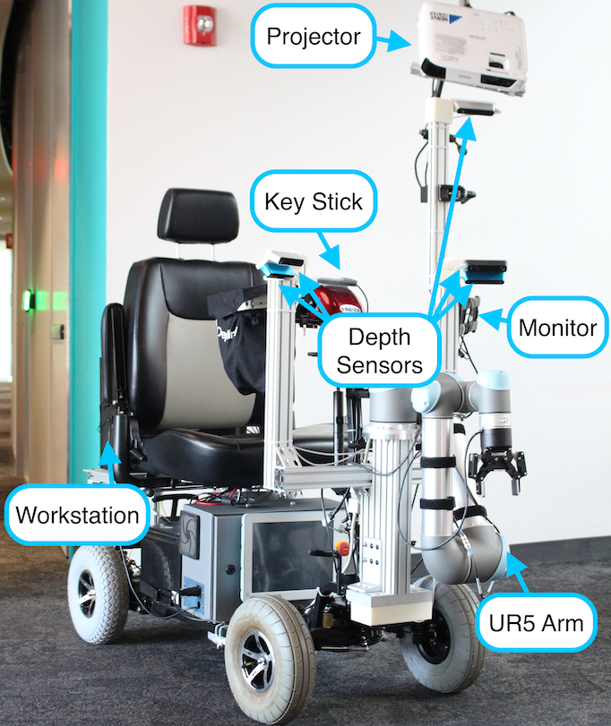
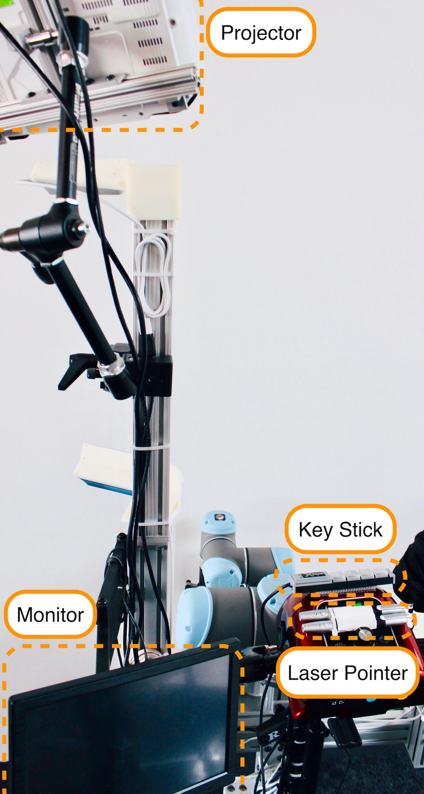

## Robotic arm for a wheelchair

This semester I worked in the [Helping Hands Lab](https://www2.ccs.neu.edu/research/helpinghands/) to develop a robotic arm attachment for a wheelchair. The goal of the wheelchair is to assist users who have difficulty grasping items to use. The wheelchair uses a Kinova Gen 3 arm to grasp objects in front of the chair and place them on a tray connected to the wheelchair. Items are identified using a GUI on the wheelchair.

Work this semester is based on previous work that was [published](https://pointw.github.io/scooter-page/) by members of the lab. Currently, we're working on improvements to constrained motion planning for the arm and updates to the user interface. Check out the current state of the scooter below!

 
