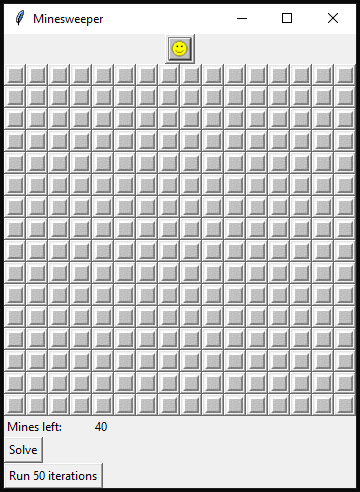

## Minesweeper as a CSP
This semester, I worked on solving Minesweeper as a constraint satisfaction problem using backtracking search and forward filtering. Our goal was to build a solver that, given a board state, could determine with as most certainty as possible which cell was safe to uncover next.

In order to do this, we formulated the game as a constraint satisfaction problem. On a high level, our solver extracts as much information as possible from the game board and translates this information to CSP constraints. When it is not able to deduce the next step with certainty, the solver will make a guess based on some heuristic or guessing function. We also built a GUI to allow users to see how one game played out under certain conditions:

 

If you're interested, [check out our paper!](https://drive.google.com/file/d/1VZQQYrsY-Yy0OETwpoxM6aMDG7H2g3Cd/view?usp=sharing)
