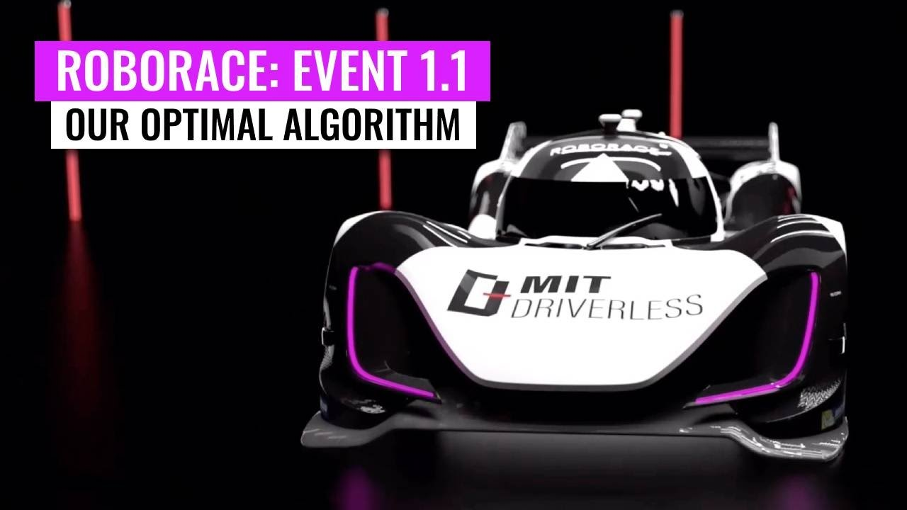

## Driverless takes on Roborace

A team I'm on, [MIT Driverless](http://driverless.mit.edu/), competed in Roborace Event 1.1 last weekend. The goal of roborace is to drive a fully autonomous vehicle around a race track as quickly as you can. Cars don't race against each other, but compete in a time trial style race. The twist: there are power ups and obstacles like in Mario Kart that, if your car collects, you get race penalties or time deductions.

## Want to see more?
Check out the race, our time starts at [3:09:00](https://www.youtube.com/watch?v=tKQAIDckIfU).\
Want to learn more? [Kylie](https://www.youtube.com/channel/UCKMjvg6fB6WS5WrPtbV4F5g) on our perception team made a [video](https://www.youtube.com/watch?v=YvIVE91WWKc)! Subscribe to her page!\
Check out our [team page](https://edgerton.mit.edu/clubs-teams/mit-driverless)
